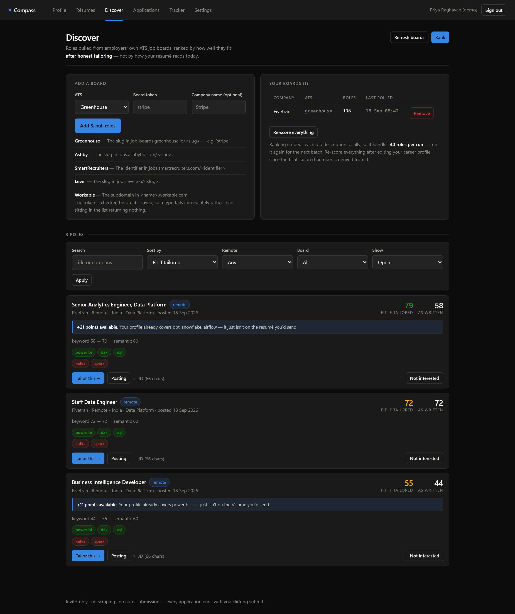
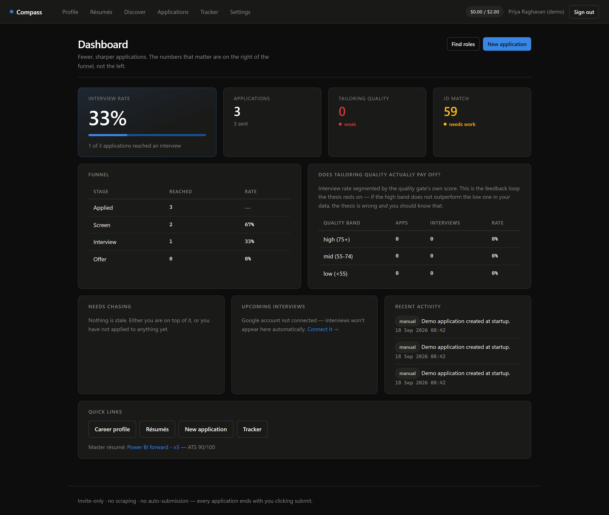
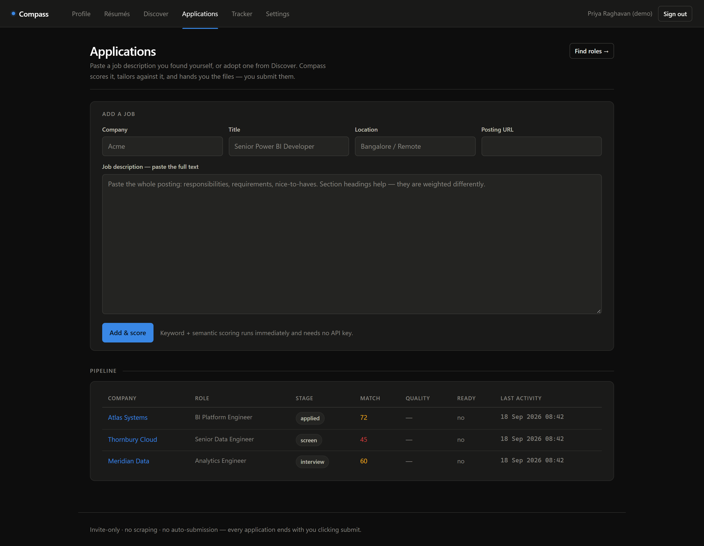
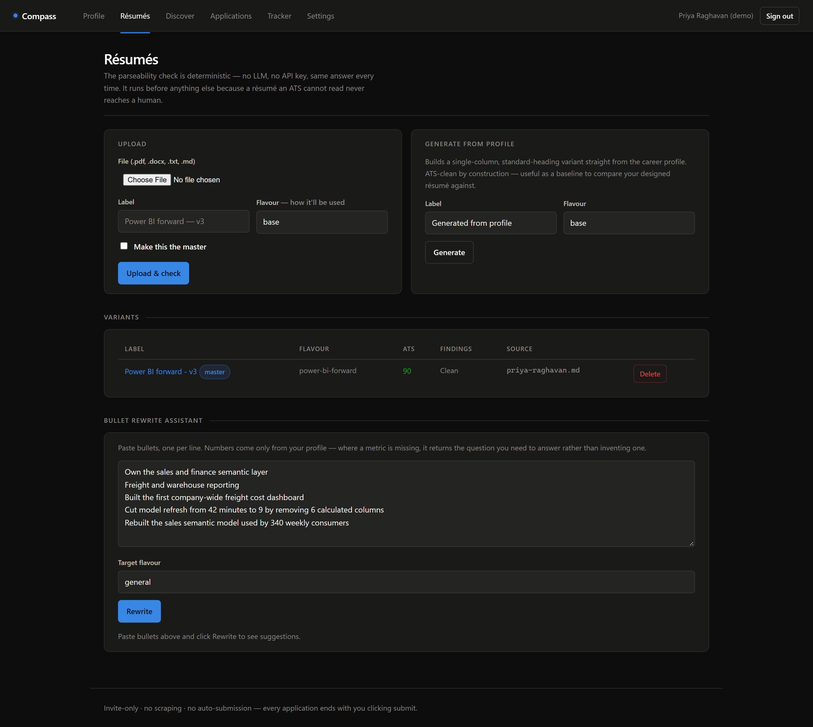
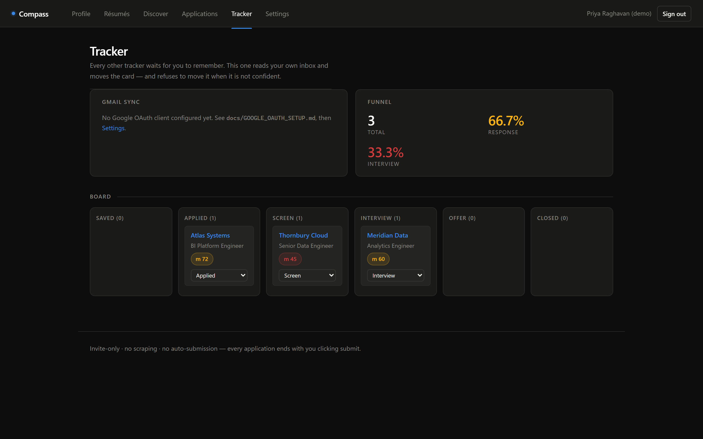
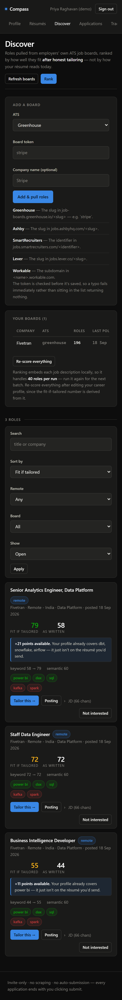

# Compass

**An AI job-search copilot that optimises for fewer, sharper applications instead of more of them.**


Compass reads a job description, scores it against your career history, tailors a
résumé and cover letter, and then **refuses to let you send it** if the letter is
a near-duplicate of the last one or says nothing specific about the employer.
That refusal is the product. Everything else is scaffolding around it.

It also ranks openings on a number most matchers do not compute: not how well
your résumé fits today, but how well it would fit **after honest tailoring** —
using evidence already in your profile that never made it onto the page.

**Live:** <https://compass-9vgo.onrender.com> · **Deploy your own:** [docs/DEPLOY.md](docs/DEPLOY.md)

---

## Screenshots

| Discover | Dashboard |
|---|---|
|  |  |

**Discover** lists roles from employers' own ATS feeds with two scores each — as
written, and if tailored. The gap between them is the signal, and the banner
names the terms to add.

**Dashboard** leads with interview rate, because it is the only number that says
whether any of this is working. It is deliberately uncoloured: applying a
red/amber/green scale to a rate would assert a benchmark this tool does not have.

<details>
<summary>Applications, Résumés, Tracker, and mobile at 390px</summary>







Responsiveness is measured with real Chrome DevTools Protocol device emulation
rather than a resized headless window, which crops the page instead of
reflowing it. See [scripts/check_responsive.py](scripts/check_responsive.py).

</details>

---

## Features

- **Career profile** — conversational intake that pushes for numbers, plus
  structured forms. Becomes the single source every other feature reads.
- **ATS parseability checker** — ~30 deterministic checks across eight groups,
  including two-column and text-box detection that most parsers miss.
- **JD matching** — weighted keyword coverage plus local semantic similarity,
  reported separately so the score is explainable.
- **Gap reports** — distinguishes *you don't have this* from *you have this and
  it isn't on the page*, which is the cheapest fix available.
- **Tailoring** — résumé bullets and cover letters grounded in profile evidence.
- **Quality gate** — six deterministic signals, two of which hard-block. No LLM.
- **Job discovery** — Greenhouse, Ashby, SmartRecruiters, Lever and Workable
  feeds, ranked by fit after tailoring.
- **Tracker** — Kanban pipeline with optional Gmail sync and Calendar events.
- **Interview prep** — per-application briefs with cited research, questions
  grounded in the real gaps, a STAR bank, and a rehearsal mode.
- **Funnel analytics** — interview rate segmented by quality band, so the
  product's own thesis is falsifiable against your data.

---

## Tech stack

| Layer | Choice | Why |
|---|---|---|
| Backend | FastAPI, Python 3.12+ | Async-capable, Pydantic validation throughout |
| Frontend | Jinja2 + HTMX 2.0 | Server-rendered; no SPA, no build step, no second host |
| Database | SQLAlchemy 2.0, SQLite or Postgres | One codebase, both dialects, portability tested |
| Migrations | Alembic | Applied at startup, with drift detection |
| AI | Gemini · Ollama · Anthropic | Pluggable; `auto` prefers free and keyless |
| Embeddings | `sentence-transformers` all-MiniLM-L6-v2 | Runs locally; lexical fallback if absent |
| Documents | pdfplumber, python-docx, ReportLab | Parse and generate PDF/DOCX |
| Auth | `hashlib.scrypt`, `itsdangerous` | Memory-hard KDF, signed cookies, no extra deps |
| Tests | pytest | 357 tests, no API key required |

No API key is needed for the ATS checker, JD scorer, tracker, analytics or
quality gate — all of it is deterministic. Only parsing, gap reports, tailoring,
email classification and prep briefs call a model.

---

## Quick start

```bash
git clone https://github.com/mor64ph/ai-jobsearch-engine.git
cd ai-jobsearch-engine

python -m venv .venv
.venv/Scripts/python.exe -m pip install -r requirements.txt   # pulls torch, ~2 GB

cp .env.example .env          # then set COMPASS_SECRET_KEY
.venv/Scripts/python.exe -m uvicorn app.main:app
```

Open <http://localhost:8000>. With no accounts yet you are sent to `/setup` to
create the owner account. The database and schema are created on first start.

On Windows, four scripts do the same thing without a terminal:

| Script | Does |
|---|---|
| `setup.cmd` | Creates the venv, installs dependencies, writes `.env`. Run once. |
| `run.cmd` | Starts the server. `run.cmd 8001` for a different port. |
| `check.cmd` | Runs the full test suite and the smoke walk. |
| `verify-llm.cmd` | Exercises every model-backed feature and reports what works. |

<details>
<summary>Lighter install, without torch</summary>

`sentence-transformers` is the only heavy dependency. Skip it and the app still
runs — [app/services/embeddings.py](app/services/embeddings.py) falls back to
pure-Python lexical similarity, and every affected score says so in the UI.
Semantic scores become approximate; nothing breaks.

With the real model, the gate's divergence signal separates cleanly: ~0.99
similarity between two near-identical letters against ~0.28 for genuinely
different ones, with the 0.85 default threshold sitting between them.

The model loads on a daemon thread, so the app serves requests about 13 seconds
after launch. It is loaded cache-first (`local_files_only=True`) — left to
itself, `SentenceTransformer(...)` revalidates every file against the Hugging
Face API on construction, measured at 49.9s versus 0.6s for identical
behaviour. Set `COMPASS_PRELOAD_EMBEDDINGS=false` to defer loading to first use.

</details>

---

## Configuration

Minimum viable `.env`:

```ini
COMPASS_SECRET_KEY=<random>   # signs the session cookie; required
GEMINI_API_KEY=...            # free tier, no card: aistudio.google.com/apikey
```

Compass refuses to start if `COMPASS_SECRET_KEY` is still the shipped default
while bound to anything other than loopback — that default is in this public
repo, so keeping it would make every session cookie forgeable.

| Variable | Default | Purpose |
|---|---|---|
| `COMPASS_LLM_PROVIDER` | `auto` | `gemini`, `ollama`, `anthropic`, or `auto` |
| `COMPASS_DB_URL` | local SQLite | Use `postgresql+psycopg://…` when hosted |
| `COMPASS_OPEN_SIGNUP` | `false` | Public registration. Read [CONSTRAINTS §1.2](docs/CONSTRAINTS.md) first |
| `COMPASS_MAX_ACCOUNTS` | `200` | Account ceiling; `0` for no limit |
| `COMPASS_SIGNUP_BUDGET_USD` | `1.0` | Monthly AI budget per self-registered account |
| `COMPASS_HTTPS_ONLY` | `false` | Marks the cookie `Secure` and sends HSTS |
| `COMPASS_DEMO_MODE` | `false` | Seeds a published demo login on an *empty* database |

Provider trade-offs: **[docs/LLM_PROVIDERS.md](docs/LLM_PROVIDERS.md)**. Gmail
and Calendar need a one-time OAuth setup with two read scopes:
**[docs/GOOGLE_OAUTH_SETUP.md](docs/GOOGLE_OAUTH_SETUP.md)**.

---

## How it works

| Step | Surface | What happens |
|---|---|---|
| 1 | **Profile** | Intake conversation and forms compile into the career profile. |
| 2 | **Résumés** | Upload a PDF/DOCX for a parseability report, or generate a clean single-column variant from the profile. |
| 3 | **Discover** | Employer ATS feeds → roles ranked by fit after tailoring → one click into step 4. |
| 4 | **Applications** | JD → match score → gap report → tailored résumé and letter → quality gate → export DOCX/PDF. |
| 5 | **Tracker** | Kanban board; Gmail sync moves cards, Calendar holds interview slots. |
| 6 | **Prep** | Cited company research, questions from the real gaps, STAR bank, rehearsal. |

### Fit after tailoring

Two scores come out of one pass over each posting:

- **as written** — coverage from the résumé alone. What a matcher shows you.
- **if tailored** — coverage once the résumé says what the profile *already
  knows*. Not invention: evidence you have and left off the page.

A role at 58 that becomes 79 once you mention the dbt work is a better use of an
evening than one flat at 72 — and the list names the exact terms to add.

### The quality gate

Before an application can be marked ready it is scored against the last N
applications on six signals:

| Signal | Weight | Asks |
|---|---|---|
| `letter_divergence` | 3.0 | Is this the same letter with the company name swapped? |
| `company_specificity` | 2.5 | Does it reference anything only this employer would recognise? |
| `bullet_divergence` | 1.5 | Were the résumé bullets actually re-tailored? |
| `jd_uptake` | 1.5 | Did tailoring close the gaps the scorer found? |
| `honesty` | 1.0 | Were real gaps recorded rather than papered over? |
| `substance` | 1.0 | Any numbers? Reasonable length? Talking points present? |

`letter_divergence` and `company_specificity` hard-block regardless of the
composite score. Blocking is overridable — sometimes a genuinely similar role
deserves a genuinely similar letter — but the override reason is stored on the
record.

**No LLM is involved.** A gate you can argue your way past is not a gate, and
asking a model to grade output from the same family of models would be exactly
that.

### Other parts worth a look

- **[ats_check.py](app/services/ats_check.py)** — the layout rules are the
  interesting ones. [text_extract.py](app/services/text_extract.py) measures the
  widest vertical whitespace channel per PDF page to catch two-column layouts
  that have no ruled table to give them away, and walks raw DOCX XML to find
  text boxes, which are invisible to `document.paragraphs`.
- **[jd_match.py](app/services/jd_match.py)** — keyword coverage (55%) plus
  semantic similarity (45%). JD sections are detected and weighted, so a term in
  *Requirements* counts 20× one in *About us*. A curated
  [skill lexicon](app/data/skill_lexicon.json) canonicalises surface forms, so
  `PowerBI` / `power-bi` / `Microsoft Power BI` are one term, and `star schema
  design` matches a JD asking for `dimensional modelling`.
- **[gmail_sync.py](app/services/google/gmail_sync.py)** — a rules pass on
  sender domains and unambiguous subjects dismisses most of a real inbox with no
  model call. Confidence below 0.6 files the email against the application but
  **does not move the card**: a wrong automatic stage change silently corrupts
  the tracker, which is worse than doing nothing.

---

## Project structure

```
app/
├── main.py                FastAPI app + lifespan
├── config.py              pydantic-settings, reads .env
├── db.py, models.py       engine, session, data model
├── web.py                 Jinja env, flash messages, failure guard
├── security.py            CSP headers, login throttle, secret-key gate
├── auth.py, scoping.py    registration, per-user record ownership
├── llm/
│   ├── client.py          provider-agnostic: cache, budgets, structured output
│   ├── providers/         one adapter per provider
│   └── prompts/*.v*.md    versioned prompt files, never inline
├── services/              one module per capability
├── routers/               one per surface
├── templates/             Jinja + HTMX (no inline JS)
└── static/js/app.js       all front-end behaviour, so the CSP can stay strict
docs/                      constraints, security, providers, deploy, QA
migrations/                Alembic
scripts/                   smoke, responsive check, LLM verify, backup
tests/                     13 modules
```

**Conventions.** Prompts are versioned files registered in `PROMPT_VERSIONS`,
and the version is part of the response cache key, so a bump invalidates stale
entries instead of silently serving output from an old prompt. LLM output models
have no `Optional` fields — strict JSON schemas are fragile with nullable
unions, so prompts emit `""` or `[]` instead. Deterministic and model-backed
logic live in separate modules.

---

## Security

- **Per-user isolation.** Every aggregate root carries `user_id`; path ids go
  through `require_owned`, which returns **404 rather than 403** for someone
  else's record, since a 403 confirms the id is real.
- **Passwords** use `hashlib.scrypt`. Login reports one message for both a wrong
  password and an unknown address, and runs the KDF either way, so timing does
  not reveal which addresses exist.
- **Per-user AI budgets**, enforced inside the LLM client via a request-scoped
  `ContextVar` rather than at each of a dozen call sites. Spend is recorded
  *before* the refusal check, so budget cannot be burned invisibly by repeatedly
  tripping a refusal.
- **The response cache is scoped per user.** Cached output derives from
  someone's résumé; serving it to another account is not a trade worth making.
- **CSP with `script-src 'self'`** — no `unsafe-inline`, no `unsafe-eval`. Every
  handler lives in `app/static/js/app.js`, wired up by `data-` attributes, which
  is why no `onclick=` exists anywhere. htmx is self-hosted rather than served
  from a CDN.
- **Failed logins are throttled** on both email and source address, checked
  before the ~100 ms KDF so the lockout is not its own denial of service.
- **Uploads are streamed and capped** with a server-side extension allowlist.
  Reading the body and measuring afterwards would mean holding a 2 GB POST in
  memory before rejecting it.

Threat model, residual risks and a pre-deployment checklist:
**[docs/SECURITY.md](docs/SECURITY.md)**.

---

## Tests

```bash
.venv/Scripts/python.exe -m pytest -q                  # 357 tests, no API key needed
.venv/Scripts/python.exe scripts/smoke.py              # boots the app, walks every route
.venv/Scripts/python.exe scripts/check_responsive.py   # CDP overflow measurement
.venv/Scripts/python.exe scripts/verify_llm.py         # exercises every model path
```

`scripts/smoke.py` runs the whole app in-process against a throwaway database
with no credentials configured. It asserts that model-backed routes degrade into
a banner rather than a 500, then prints the ATS score, the JD match breakdown
and every quality-gate signal — the fastest way to see whether a scoring change
did what you intended.

Three of the thirteen suites carry most of the weight:

- **`test_constraints.py`** — the architecture guard. No scraping libraries, no
  URLs targeting restricted platforms, no submit endpoint, no LLM call inside
  the quality gate or ATS checker, no inline prompts, no inline JS, and no
  blocking-LLM route declared `async`. A prose instruction is easy to forget
  across sessions; a failing test is not.
- **`test_tenancy.py`** — exercised over HTTP rather than the service layer,
  because the failure being guarded against is *a route that forgot to scope its
  query*, and a service-level test would pass while the route leaked.
- **`test_ats_check.py`** — every rule plus its false-positive case: a narrow
  gutter is not a two-column layout.

[docs/MANUAL_QA.md](docs/MANUAL_QA.md) covers what automation cannot reach — live
model calls, a real Google account, real résumé files, and whether the output is
any *good*.

---

## Deployment

Runs on free tiers with no card required: **Render** (native Python runtime)
plus **Neon** Postgres. [render.yaml](render.yaml) is a blueprint — point Render
at the repo and apply it, then set `COMPASS_DB_URL` and `GEMINI_API_KEY` in the
dashboard.

Two constraints shape that blueprint. Render's free plan has **512 MB of RAM**,
so the build installs `deploy/render/requirements-slim.txt` and runs without the
embedding model; that file documents exactly what is lost. And free instances
have **no persistent disk**, so Postgres is not optional — SQLite there survives
neither a deploy nor a wake from idle.

Full walkthrough, alternatives and the pre-flight checklist:
**[docs/DEPLOY.md](docs/DEPLOY.md)**. A `Dockerfile` is in `deploy/render/` if
you would rather run a container.

---

## Constraints

Two boundaries are enforced by tests, not by convention:

- **No scraping, no session automation.** Not of LinkedIn, Naukri, Indeed,
  Foundit, Wellfound, Glassdoor, Fishbowl or Reddit. Postings arrive through
  employers' own public ATS APIs, or by pasting a JD you found yourself. The
  allowlist is pinned by a test, and the fetch layer has exactly one outbound
  call site.
- **No autonomous submission.** Compass produces the files; you click submit.
  There is no submit endpoint, and the build fails if one appears.

The reasoning is in **[docs/CONSTRAINTS.md](docs/CONSTRAINTS.md)**. It is the
product thesis rather than a compliance footnote: a tool built to fire off 200
applications would be solving the wrong problem.

---

## Roadmap

- Outreach UI — the `Contact` and `OutreachMessage` tables exist; nothing writes
  to them from an automated path yet.
- A scheduler, for the weekly digest.
- Additional ATS adapters behind the existing source interface.
- Encryption at rest and a privacy policy, both prerequisites for holding other
  people's career data at scale. An operator who does becomes a data fiduciary
  under India's DPDP Act, which needs a lawyer rather than a `TODO`.

---

## Licence

Not yet chosen. Until a licence file is added, default copyright applies and no
permissions are granted.
